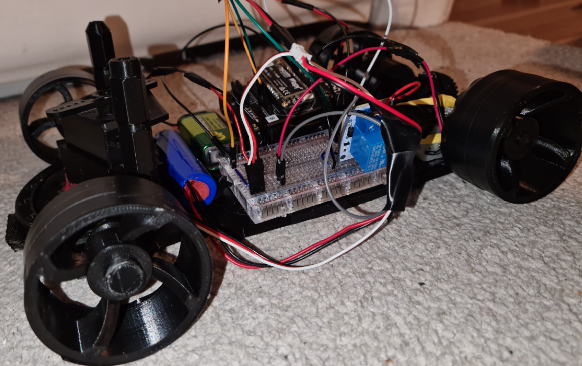

<table align="center"><tr><td align="center" width="9999">

# MQ(ar)TT 

### a wireless mini car made entirely from 3d printed parts 
</td></tr></table>

  

    
## Abstract
With the help of 3d modeling, I have created something straight from scratch. Instead of using the base of an RC car with its steering mechanics, driving axle, and mounting our electronics I made something out of nothing and visualized a functional car made entirely from us.
I wanted to control the car by an application running via bluetooth but I ran into some issues with connectivity so I changed the direction of our connection to MQTT servers instead. During the late stages of the project problems were stacking up but I managed them.

## Background and Idea
Deciding what to create for this task I was sure that I wanted something that wasn't static. There was many project ideas that couldn't move and there were no reason for them to move either since they could be a weather station or an alarm system. I had no previous experience with electronics and thus I thought it would be good to keep it simple and basic. A RC-car sounded like a fun and interesting project idea that fit my reasoning and since I have a 3d printer and experience with Fusion360 the choice was made.

## Method

[Requirements](./doc/requirements.md)  \
[Hardware](./doc/hardware.md)  \
[Setup](./doc/setup.md)  \
[Timelog](./doc/timelog.md)  \
[Source](./src)  \
[Images](./img)  \
[Pictures of the results](./img/results)  \
[Fusion360 design and 3d models](./img/3d%20models)

## Results

Starting the project with the 3d modeling which took about a total of 25-30hours, I set out a goal that the entire car was to be made out of me, all mechanical parts were included. Making different steering mechanics, gears, ball and roller bearings and mechanical parts in general in such a small size as of a RC car was a real challenge.

The initial servo used was way too weak to be able to make the car steer left and right. It was unfortunate that I realized it very late in to the project, when all parts already had been printed. Instead of designing and printing another prototype I used lots of glue to secure crucial parts of the car that were exposed. With a little cage printed for the second servo it found it's place in the center in the front. It worked very well with the steering mechanism. It weighed a lot more than the first servo and demanded higher voltages which added lots of extra weight. If I were to consider small things like that from the beginning the end results could've been better.  

The flaws that caused the most trouble were design related. The first prototype of the driving axle hade many issues. I didn't get an accelerometer in time so I couldn't regulate the speed without directly modifying the voltages on the battery. All it took was a little gap between the gears for them to completely seperate and spin like two beyblades. By printing some small adjustments with somewhat bigger gears I could use these with the old prints and make the driving axle steady with the gears aligned.
I knew that traction would be an issue but it was not a priority because many solutions were available and I eventually went with the rubber bands.

 

# Software , code
The code worked very well. Initially I thought that Adafruit.IO on a mobile phone could be used to press more than one button at a time but the use of momentary buttons did not work like that. The reasoning behind the three feeds *left-turn*, *right-turn* and *myfeed* was that by all being seperated one button could be pressed and another one still be held down and the information would reach the lopy. This wasn't the case and instead of buttons only triggering one function each, some values being recieved would activate both the steering and the motor. It worked well but wasn't optimal.
To remain connection to both the wifi and mqtt server was very tricky. Lots of different code was written for this loop and still it could need some work. Since the mqtt library didn't have any methods like network with .isconnected(), checking the connection status was hard. I tried many approaches, one were AdafruitIO triggers that would publish a certain value when I was connected. If I was successfully connected and subscribed to desired topics I would recieve a value or a message instead of *None* when .check_msg() or wait_msg() was active which would indicate that connection was established. The ping() method from the mqtt library was not successful either and in the end I went with try except and made our own pinging method. Using the code on the finished car worked very well and the car had great response to the input from AdafruitIO.

 

