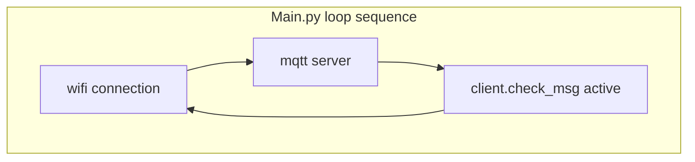

# Overview
The controls of the car is dependent on internet and a MQTT service. We used Adafruits free mqtt servers to communicate with the car but any MQTT server will do the job.
The process is very simple. When the lopy is booted it runs boot.py which tries to establish an internet connection via a static network and if it does, main.py is run and tries to connect to the mqtt server. With an established connection we subscribe to three different topics on the server regarding forward movement, steering to the right and steering to the left. Two topics is only needed because you can't steer both left and right at the same time, but that's what we started with and it got stuck. Now that we are subscribed to the necessary topics, published information will find it's way to us and we can use this to activate different functions that in turn activates the servo or/and the motor. If any problems occur during the "connect phase" to either the wifi or the mqtt server, code exists to continously try to connect the lopy to either faulty connection.

## Software used
It is important to use a reliable text editor and the ones we've used are Visual Studio and Atom. Visual Studio has not been used that much but  it has been helpful to have it around when Atom was too crowded. Atom worked way better for the connection to the Lopy so I highly recommend Atom over Visual Studio over projects like this. We used Adafruit.IO as our MQTT service.
### Adafruit.IO setup
The setup is very easy. To cover all bases, make sure to have a mqtt library ready. We used [umqttsimple](https://raw.githubusercontent.com/RuiSantosdotme/ESP-MicroPython/master/code/MQTT/umqttsimple.py) as our library for this project. Taking granted that drivers and packages required are installed, head over to  and register for a free account. Go to the IO page if you haven't already and click on "My key". On this page you will find keys and other sensitive information needed for you to connect to Adafruit's services. Look for the ADAFRUIT_IO_USERNAME and ADAFRUIT_IO_KEY and copy them, these two will be used for the connection. With the umqttsimple library it is now possible to connect ourselves to Adafruit.IO. Check out the two tabs "Dashboard" and "Feeds" and follow the tutorials to set up your dashboard/feed the right way. We used momentary buttons with different values to trigger the functions of the car.
```
client = MQTTClient("client_name", "io.adafruit.com",user="USER", password="KEY", port="PORTNUMBER")
```

# Code
When powering up, the lopy first runs boot.py and then main.py. The third file present is **mqtt.py** which is the [downloaded umqttsimple](https://raw.githubusercontent.com/RuiSantosdotme/ESP-MicroPython/master/code/MQTT/umqttsimple.py). Let's divide the files and make some sense of the code.
## Boot.py
Boot.py is the first file to be executed which makes it convenient to have the wifi code on this file.
```
import network
import time
import machine

def connect_wifi():
    wifi = network.WLAN(mode=network.WLAN.STA)
    reconnect_count = 0
    print("Connecting to wifi")
    wifi.connect('SSID', auth=(network.WLAN.WPA2, 'PASSWORD'))
    while not wifi.isconnected():
        print(".",end="")
        time.sleep(1)
        reconnect_count += 1
        if reconnect_count == 15:
            print("rebooting")
            machine.reset()
    print("connection established!")

connect_wifi()
```
By having the code in a function it can be used in main.py as well if necessary. The lopy is always checking the connections to both the wifi and the MQTT server. Wifi is prioritized since it's needed to access the internet for connecting to a mqtt server. 
The connect_wifi() function will be running for up to 15 seconds if no wifi is found, when 15 seconds have gone since the first attempt to try to connect the lopy to wifi it will reboot. Machine_idle() could be used here as well.

## Main.py
After booting up, the next step of the connection process is the mqtt server. The code in main.py is mainly for the mqtt connection but it also has the reconnect feature if something were to happen to either the wifi or mqtt connection. 
The loop is running in this fashion.
* 1) Make sure wifi is connected, if not run connect_wifi(). 
* 2) Check mqtt connection, if not connected run the necessary code to try to reconnect. 
* 3) If both wifi and mqtt are connected, client.check_msg() is active. 
* 4) Repeat


```
import network
import time
from machine import PWM
from machine import Pin
from mqtt import MQTTClient

# Define pins on the LoPy4

powerpin = Pin("P8", mode=Pin.OUT)
servo = machine.PWM(0, frequency=50)
servo_c = servo.channel(0, pin='P12', duty_cycle=0.09)  # duty_cycle operates within 0.02-0.12
mqtt_check = False
CLIENT_NAME = " "                  #  User info required to be able to use Adafruit IO
USER_NAME = " "                    
IO_KEY = " "                        
PING_INTERVAL_MS = 

# Steering and motor controls           
# If car is understeering/oversteering, increase/decrease the duty_cycle.
# We used these three --> Left, 0.070 -- Default/forward, 0.090 -- Right, 0.105

def turn_left():
    servo_c.duty_cycle(0.070)

def turn_left_forward():
    servo_c.duty_cycle(0.070)
    powerpin.value(1)

def turn_right_forward():
    servo_c.duty_cycle(0.105)
    powerpin.value(1)

def turn_right():
    servo_c.duty_cycle(0.105)

def default_position():
    servo_c.duty_cycle(0.09)

def reset_car():
    default_position()
    powerpin.value(0)

def sub_cb(topic, msg):
    global last_ping
    print(msg)
    if msg == b'{"feeds":{"myfeed":"1"}}':                  # Forward
        powerpin.value(1)
        last_ping = utime.ticks_ms()
    elif msg == b'{"feeds":{"left-turn":"0"}}':             # Release motor
        powerpin.value(0)
        last_ping = utime.ticks_ms()
    elif msg == b'{"feeds":{"left-turn":"2"}}':             # Left turn, amount of steering depending on duty cycle.
        turn_left()
        last_ping = utime.ticks_ms()
    elif msg == b'{"feeds":{"right-turn":"4"}}':            # Right
        turn_right()
        last_ping = utime.ticks_ms()
    elif msg == b'{"feeds":{"right-turn":"5"}}' or b'{"feeds":{"left-turn":"7"}}' or b'{"feeds":{"right-turn":"9"}}' or b'{"feeds":{"left-turn":"3"}}':
        reset_car()
        last_ping = utime.ticks_ms()
    elif msg == b'{"feeds":{"left-turn":"6"}}':
        turn_left_forward()
        last_ping = utime.ticks_ms()
    elif msg == b'{"feeds":{"right-turn":"8"}}':
        turn_right_forward()
        last_ping = utime.ticks_ms()

client = MQTTClient("RC-car", "io.adafruit.com",user="USER_NAME", password="PASSWORD", port=1883)
client.set_callback(sub_cb)

while True:
    if not wifi.isconnected():
        connect_wifi()
    elif wifi.isconnected():
        try:
            if mqtt_check == False:
                print("Connecting to mqtt")
                client.connect()
                time.sleep(1)
                client.subscribe(topic="FEEDS/CONNECTION")
                client.publish("FEEDS/CONNECTION", "ping", retain=True)
                time.sleep(2)
                mqtt_check = True
                last_ping = utime.ticks_ms()                                        # Timed last recieved message from Adafruit.IO
                print("MQTT connected!")
                while mqtt_check == True:
                    if utime.ticks_ms()-last_ping < PING_INTERVAL:
                        client.check_msg()
                    else:
                        try:                                                                        
                            client.publish("FEEDS/CONNECTION", "ping", qos=2)          # If publish fails, exception  runs
                            last_ping = utime.ticks_ms()                                           # Resetting ping timer
                        except Exception:
                            print("Connection lost to Adafruit. Trying to reconnect")
                            mqtt_check = False                                  # Reloop
        except Exception:
            print("unable to connect to mqtt server" + "\nMaking sure wifi is connected..",end="")
            if wifi.isconnected():                          # updating to check connection, rebooting if wifi is signal is lost
                print("... wifi is connected")
                time.sleep(1)
                print("rebooting in 5 seconds..",end=" ")
                for number in range(5):
                    print(5-number,end=" ")
                    time.sleep(1)
                machine.reset()
            else:
                print("wifi disconnected. Trying to reconnect")     

```
## mqtt.py
This file is used to import **MQTTClient** to main.py. Without this no communication could take place. Contains lots of useful functions, but the ones we used the most are *MQTTClient.connect()*, *MQTTClient.subscribe* and *MQTTClient.set_callback*. 
It is the set_callback function that we made trigger other functions depending on the incoming messages published from Adafruit.IO.
```
try:
    import usocket as socket
except:
    import socket
import ustruct as struct
from ubinascii import hexlify

class MQTTException(Exception):
    pass

class MQTTClient:

    def __init__(self, client_id, server, port=0, user=None, password=None, keepalive=0,
                 ssl=False, ssl_params={}):
        if port == 0:
            port = 8883 if ssl else 1883
        self.client_id = client_id
        self.sock = None
        self.server = server
        self.port = port
        self.ssl = ssl
        self.ssl_params = ssl_params
        self.pid = 0
        self.cb = None
        self.user = user
        self.pswd = password
        self.keepalive = keepalive
        self.lw_topic = None
        self.lw_msg = None
        self.lw_qos = 0
        self.lw_retain = False

    def _send_str(self, s):
        self.sock.write(struct.pack("!H", len(s)))
        self.sock.write(s)

    def _recv_len(self):
        n = 0
        sh = 0
        while 1:
            b = self.sock.read(1)[0]
            n |= (b & 0x7f) << sh
            if not b & 0x80:
                return n
            sh += 7

    def set_callback(self, f):
        self.cb = f

    def set_last_will(self, topic, msg, retain=False, qos=0):
        assert 0 <= qos <= 2
        assert topic
        self.lw_topic = topic
        self.lw_msg = msg
        self.lw_qos = qos
        self.lw_retain = retain

    def connect(self, clean_session=True):
        self.sock = socket.socket()
        addr = socket.getaddrinfo(self.server, self.port)[0][-1]
        self.sock.connect(addr)
        if self.ssl:
            import ussl
            self.sock = ussl.wrap_socket(self.sock, **self.ssl_params)
        premsg = bytearray(b"\x10\0\0\0\0\0")
        msg = bytearray(b"\x04MQTT\x04\x02\0\0")

        sz = 10 + 2 + len(self.client_id)
        msg[6] = clean_session << 1
        if self.user is not None:
            sz += 2 + len(self.user) + 2 + len(self.pswd)
            msg[6] |= 0xC0
        if self.keepalive:
            assert self.keepalive < 65536
            msg[7] |= self.keepalive >> 8
            msg[8] |= self.keepalive & 0x00FF
        if self.lw_topic:
            sz += 2 + len(self.lw_topic) + 2 + len(self.lw_msg)
            msg[6] |= 0x4 | (self.lw_qos & 0x1) << 3 | (self.lw_qos & 0x2) << 3
            msg[6] |= self.lw_retain << 5

        i = 1
        while sz > 0x7f:
            premsg[i] = (sz & 0x7f) | 0x80
            sz >>= 7
            i += 1
        premsg[i] = sz

        self.sock.write(premsg, i + 2)
        self.sock.write(msg)
        #print(hex(len(msg)), hexlify(msg, ":"))
        self._send_str(self.client_id)
        if self.lw_topic:
            self._send_str(self.lw_topic)
            self._send_str(self.lw_msg)
        if self.user is not None:
            self._send_str(self.user)
            self._send_str(self.pswd)
        resp = self.sock.read(4)
        assert resp[0] == 0x20 and resp[1] == 0x02
        if resp[3] != 0:
            raise MQTTException(resp[3])
        return resp[2] & 1

    def disconnect(self):
        self.sock.write(b"\xe0\0")
        self.sock.close()

    def ping(self):
        self.sock.write(b"\xc0\0")

    def publish(self, topic, msg, retain=False, qos=0):
        pkt = bytearray(b"\x30\0\0\0")
        pkt[0] |= qos << 1 | retain
        sz = 2 + len(topic) + len(msg)
        if qos > 0:
            sz += 2
        assert sz < 2097152
        i = 1
        while sz > 0x7f:
            pkt[i] = (sz & 0x7f) | 0x80
            sz >>= 7
            i += 1
        pkt[i] = sz
        #print(hex(len(pkt)), hexlify(pkt, ":"))
        self.sock.write(pkt, i + 1)
        self._send_str(topic)
        if qos > 0:
            self.pid += 1
            pid = self.pid
            struct.pack_into("!H", pkt, 0, pid)
            self.sock.write(pkt, 2)
        self.sock.write(msg)
        if qos == 1:
            while 1:
                op = self.wait_msg()
                if op == 0x40:
                    sz = self.sock.read(1)
                    assert sz == b"\x02"
                    rcv_pid = self.sock.read(2)
                    rcv_pid = rcv_pid[0] << 8 | rcv_pid[1]
                    if pid == rcv_pid:
                        return
        elif qos == 2:
            assert 0

    def subscribe(self, topic, qos=0):
        assert self.cb is not None, "Subscribe callback is not set"
        pkt = bytearray(b"\x82\0\0\0")
        self.pid += 1
        struct.pack_into("!BH", pkt, 1, 2 + 2 + len(topic) + 1, self.pid)
        #print(hex(len(pkt)), hexlify(pkt, ":"))
        self.sock.write(pkt)
        self._send_str(topic)
        self.sock.write(qos.to_bytes(1, "little"))
        while 1:
            op = self.wait_msg()
            if op == 0x90:
                resp = self.sock.read(4)
                #print(resp)
                assert resp[1] == pkt[2] and resp[2] == pkt[3]
                if resp[3] == 0x80:
                    raise MQTTException(resp[3])
                return

    # Wait for a single incoming MQTT message and process it.
    # Subscribed messages are delivered to a callback previously
    # set by .set_callback() method. Other (internal) MQTT
    # messages processed internally.
    def wait_msg(self):
        res = self.sock.read(1)
        self.sock.setblocking(True)
        if res is None:
            return None
        if res == b"":
            raise OSError(-1)
        if res == b"\xd0":  # PINGRESP
            sz = self.sock.read(1)[0]
            assert sz == 0
            return None
        op = res[0]
        if op & 0xf0 != 0x30:
            return op
        sz = self._recv_len()
        topic_len = self.sock.read(2)
        topic_len = (topic_len[0] << 8) | topic_len[1]
        topic = self.sock.read(topic_len)
        sz -= topic_len + 2
        if op & 6:
            pid = self.sock.read(2)
            pid = pid[0] << 8 | pid[1]
            sz -= 2
        msg = self.sock.read(sz)
        self.cb(topic, msg)
        if op & 6 == 2:
            pkt = bytearray(b"\x40\x02\0\0")
            struct.pack_into("!H", pkt, 2, pid)
            self.sock.write(pkt)
        elif op & 6 == 4:
            assert 0

    # Checks whether a pending message from server is available.
    # If not, returns immediately with None. Otherwise, does
    # the same processing as wait_msg.
    def check_msg(self):
        self.sock.setblocking(False)
        return self.wait_msg()
```
